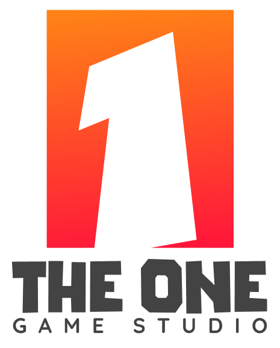

<div align="center">

```ascii
████████╗██╗   ██╗██╗  ██╗ █████╗     ██████╗  ██████╗ ██████╗ 
╚══██╔══╝██║   ██║██║  ██║██╔══██╗    ██╔══██╗██╔════╝ ╚════██╗
   ██║   ██║   ██║███████║███████║    ██████╔╝███████╗  █████╔╝
   ██║   ██║   ██║██╔══██║██╔══██║    ██╔══██╗██╔═══██╗ ██╔═══╝ 
   ██║   ╚██████╔╝██║  ██║██║  ██║    ██████╔╝╚██████╔╝ ███████╗
   ╚═╝    ╚═════╝ ╚═╝  ╚═╝╚═╝  ╚═╝    ╚═════╝  ╚═════╝  ╚══════╝
                                                                 
    ██████╗  █████╗ ███╗   ███╗███████╗    ██████╗ ███████╗██╗   ██╗
   ██╔════╝ ██╔══██╗████╗ ████║██╔════╝    ██╔══██╗██╔════╝██║   ██║
   ██║  ███╗███████║██╔████╔██║█████╗      ██║  ██║█████╗  ██║   ██║
   ██║   ██║██╔══██║██║╚██╔╝██║██╔══╝      ██║  ██║██╔══╝  ╚██╗ ██╔╝
   ╚██████╔╝██║  ██║██║ ╚═╝ ██║███████╗    ██████╔╝███████╗ ╚████╔╝ 
    ╚═════╝ ╚═╝  ╚═╝╚═╝     ╚═╝╚══════╝    ╚═════╝ ╚══════╝  ╚═══╝  
```


<div align="center">
  
</div>

### 🎮 Interactive Game Zone - Try the Snake Game! 🐍
[](https://tuha263.github.io)
[](https://github.com/tuha263/tuha263.github.io)

</div>

---

## 🎯 Player Stats

<div align="center">
  
[](https://github.com/tuha263)

</div>

<div align="center">
  
  
</div>

<div align="center">
  
### 🚀 Development Metrics
[](https://github.com/tuha263)
[](https://github.com/tuha263)
[](https://github.com/tuha263)


---

## 🎮 Game Development Arsenal

### 🕹️ Game Engines & Frameworks
<div align="center">
  


</div>

### 💻 Programming Languages
<div align="center">
  


</div>

### 🔧 Development Tools
<div align="center">
  


</div>

---

## 🏆 Achievement Unlocked!

<div align="center">
  
[](https://github.com/ryo-ma/github-profile-trophy)

</div>

---

## 📊 Language Stats - Character Classes

<div align="center">
  


</div>

---

## 🎯 The One Game Studio - Skill Progression

<div align="center">
  
### 🏢 Building The One Game Studio


</div>

<div align="center">

### 🎯 Professional Skills Matrix

<table>
<tr>
<td align="center" width="50%">

#### 🎮 Core Game Development
```
Game Design & Architecture    ████████████████████ 95%
Unity/C# Development         ████████████████████ 92%
Graphics & Shader Programming ██████████████████░░ 88%
AI & Machine Learning        █████████████████░░░ 85%
```

</td>
<td align="center" width="50%">

#### 🚀 Advanced Technologies
```
Multiplayer & Networking     ████████████████░░░░ 80%
VR/AR Development           ███████████████░░░░░ 75%
Mobile Optimization         ██████████████░░░░░░ 70%
DevOps & CI/CD              █████████████░░░░░░░ 65%
```

</td>
</tr>
</table>

### 🎯 Current Focus & Activity

<div align="center">
  
| 🎮 **Active Projects** | 🚀 **Status** | 🎯 **Priority** |
|------------------------|---------------|----------------|
| Unity Screw Puzzle    | Development   | HIGH 🔥        |
| Resource Management    | Testing       | MEDIUM 🟡      |
| Object Pooling         | Optimization  | MEDIUM 🟡      |
| Real-time Multiplayer  | Research      | LOW 🔵         |

</div>

### 🏆 2024 Development Milestones
[](https://github.com/tuha263)
[](https://github.com/tuha263)
[](https://github.com/tuha263)

**🏢 Studio Mission:** Building next-generation puzzle mechanics with physics-based innovations  
**🔧 Tech Stack:** JetBrains Rider + Claude Code + Unity 2023.x + C# .NET 6.0+  
**🎯 Current Sprint:** Physics-based screw threading simulation for Q4 2024

</div>

---

## 📈 Activity Graph - Daily XP Gain

<div align="center">
  
[](https://github.com/ashutosh00710/github-readme-activity-graph)

</div>

---

## 🎮 Recent GitHub Activity

<!--START_SECTION:activity-->
1. 🎉 Merged PR [#5](https://github.com/The1Studio/theonekit-release-action/pull/5) in [The1Studio/theonekit-release-action](https://github.com/The1Studio/theonekit-release-action)
2. 💪 Opened PR [#5](https://github.com/The1Studio/theonekit-release-action/pull/5) in [The1Studio/theonekit-release-action](https://github.com/The1Studio/theonekit-release-action)
<!--END_SECTION:activity-->

---

## 🌟 Featured Projects & Achievements

<div align="center">

### 🎮 Interactive Portfolio Website
[](https://github.com/tuha263/tuha263.github.io)

**🎯 Live Demo:** [tuha263.github.io](https://tuha263.github.io) | **🐍 Play Snake Game** | **⚡ Interactive Stats**

</div>

### 🏆 Professional Game Development Portfolio

<div align="center">

[](#)
[](#)
[](#)

</div>

<details>
<summary><b>🎮 Click to expand - Recent Game Development Highlights</b></summary>

```yaml
🎲 Current Projects:
  - Unity Screw Puzzle: "Advanced physics-based puzzle mechanics"
  - Resource Management System: "Efficient memory allocation for mobile games"  
  - Object Pooling Framework: "Performance optimization for high-frequency spawning"
  - Real-time Multiplayer: "Low-latency networking for competitive gameplay"
  
🏅 Technical Achievements:
  - 60FPS stable performance on mobile devices
  - Advanced shader programming for visual effects
  - AI behavior trees for intelligent NPCs
  - Cross-platform deployment automation
  
🔧 Tools & Frameworks:
  - Unity 2023.x LTS
  - C# .NET 6.0+
  - Universal Render Pipeline (URP)
  - Addressables Asset System
  - Mirror Networking
```

</details>

---
## 📫 Connect & Collaborate

<div align="center">

[](https://github.com/tuha263)
[](https://www.linkedin.com/in/hoang-tu-96618588/)
[](mailto:tuha263@gmail.com)
[](https://discord.com/users/tu9050)
[](https://steamcommunity.com/id/tuha263/)

</div>

### 💬 Quick Contact
- 📧 **Email**: tuha263@gmail.com
- 💬 **Discord**: tu9050
- 🎮 **Steam**: [tuha263](https://steamcommunity.com/id/tuha263/)
- 💼 **LinkedIn**: [Hoang Tu](https://www.linkedin.com/in/hoang-tu-96618588/)

</div>

---

<div align="center">

```ascii
╔══════════════════════════════════════════════════════════════════════╗
║                          GAME OVER - THANKS FOR PLAYING!             ║
║                                                                      ║
║  🎮 Ready for collaboration? Let's build something amazing together! ║
║                                                                      ║
║                          [PRESS START TO CONTINUE]                   ║
╚══════════════════════════════════════════════════════════════════════╝
```


### 🚀 Quick Connect Actions
[](mailto:tuha263@gmail.com)
[](https://discord.com/users/tu9050)
[](https://steamcommunity.com/id/tuha263/)

---

<details>
<summary><b>⚡ Fun Fact - Click to reveal!</b></summary>

```javascript
const developer = {
    name: "Tuha",
    role: "Game Developer",
    favoriteLanguage: "C#",
    primaryIDE: "JetBrains Rider",
    aiAssistant: "Claude Code",
    currentlyPlaying: ["Snake Game", "Unity Editor"],
    funFact: "Claude Code + JetBrains = Perfect development flow 🚀",
    motto: "Code it, play it, ship it!"
};

console.log("Thanks for checking out my profile! 🎮");
```

</details>

**💫 "Every line of code is a step towards the next great adventure!"**

</div>